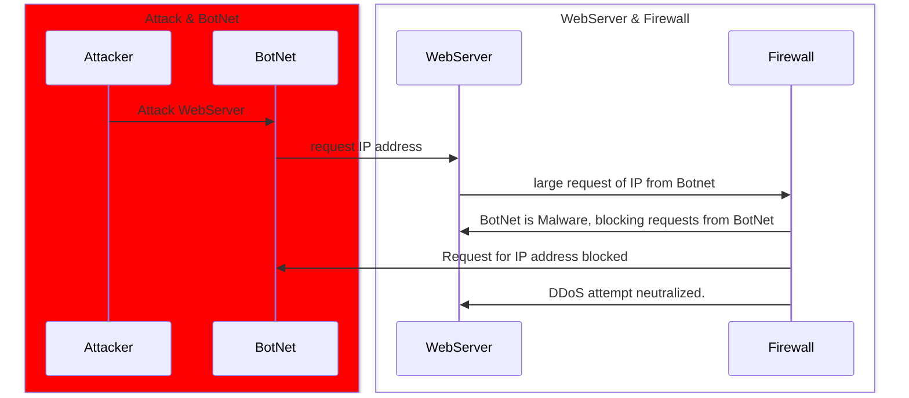

```mermaid
sequenceDiagram
  Box Red Attack & BotNet
  participant Attacker
  participant BotNet
  End
  Box WebServer & Firewall
  participant WebServer
  participant Firewall
  End
Attacker->>BotNet: Attack WebServer
BotNet->>WebServer: request IP address
WebServer->>Firewall: large request of IP from Botnet
Firewall->>WebServer: BotNet is Malware, blocking requests from BotNet
Firewall->>BotNet: Request for IP address blocked
Firewall->>WebServer: DDoS attempt neutralized.
```
