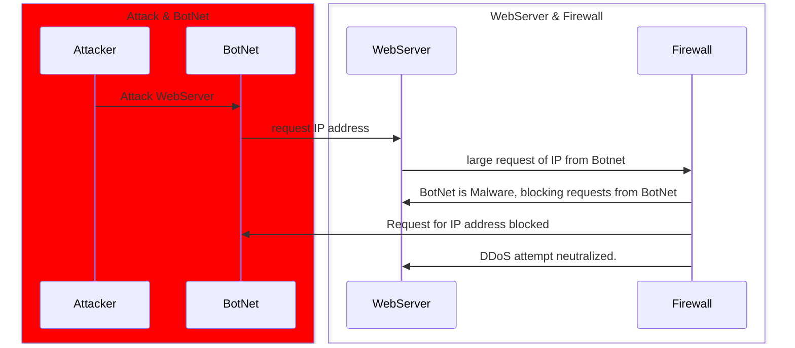

# Description
  1. The Attacker Tells the BotNet to attack the WebServer by requesting WebServer IP Address
  2. The BotNet Then request the WebServers IP address to overwhelm the system
  3. WebServer notifies the Firewall that there have been multiple requests for servers IP Address
  4. Firewall analyses the Bots using packet filtering and defines them as threats to the WebServer
  5. Firewall Blocks the BotNets request for the WebServer IP Address, Protecting the WebServer from the DDoS Attack

- Attacker
    - Initiates the Attack on the WebServer
- BotNet
    - Overloads the WebServer by making thousands of requests for the WebServer IP address effectively overwhelming the WebServer
- Webserver
    - The Host that is being attacked
- Firewall
    - The protective system set in place protects the WebServer from malicious attacks from bots by using packet filtering and other techniques to analyze the bots and determine whether or not they hold a potential threat to the system. If defined as a threat the Firewall then blocks the Bots

- Packet Filtering - a network security technique that examines data packets to determine whether to allow or block them based on a set of rules.
